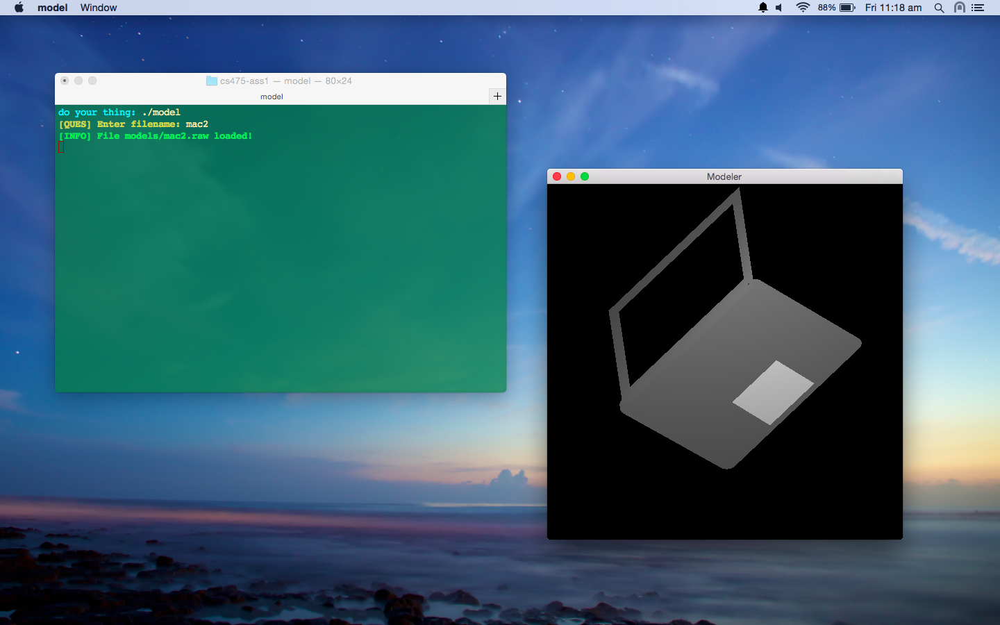

# CS475 Assignment 1
-----
#### Alankar Kotwal (12D070010), Manish Goregaokar (120260006)  

##### Running the program
To compile the code unzip the submission, go to the un-zipped folder and type 
```sh
$ make
```
This should generate an executable called `model` in the folder. To run the executable type
```sh
$ ./model
```

The models we're submitting are in the `models/` directory. To load a model, press `L` on the GLFW window and type the name of the model you want to load. The models we're submitting are

 - mac2
 - table2
 - tubelight2

To load `mac2` press `L` and type `mac2` on the terminal window and press `Enter`. The program will add the directory name and extension by itself.

The original versions of these models can be found in the `mac`, `table`, and `tubelight` models. They were rotated using this modeling program (see the `T` control). There additionally are many example models of shapes in the models folder.

##### Controls

###### Inspection mode:
The inspection mode controls are as follows:
 - `I` activates the inspection mode.
 - `L` loads a model from the `models/` directory.
 - `A` and `D` move the currently loaded model in the + and - x-direction respectively.
 - `W` and `S` move the currently loaded model in the + and - y-direction respectively.
 - `Z` and `X` move the currently loaded model in the + and - z-direction respectively.
 - The right and left arrow keys provide rotation about the x-axis.
 - The top and bottom arrow keys provide rotation about the y-axis.
 - The Page Up and Page Down keys provide rotation about the z-axis.
 - `Q` and `E` scale the model so as to provide zoom.
 - `R` re-centers the model at its centroid.
 - `Tab` changes the currently active (displayed) model.
 - `V` toggles pesudo-lighting.
 - `+` and `-` increase/decrease the lighting intensity.
 - `T` flushes the transformation onto the model itself. In other words, the current transformation is applied to the model, and is then set to the identity transform. Using this, one can load a model, rotate it, flush the rotation to the model, and save the rotated model. (This was used to create `mac2` from `mac`, etc.)

###### Modeling mode:
In addition to the controls in the inspection mode, we have the following controls in the modeling mode:
 - `M` activates the modeling mode.
 - Clicking adds a new point at the point you click on and the active z-coordinate.
 - Scrolling adjusts the active z-coordinate so that we're able to draw in 3D.
 - Shift + clicking removes the last added point.
 - `C` followed by the R, G, B and A values in the terminal sets the drawing color. 
 - `F` finishes the current polygon, so the next drawn point will be in a new polygon. The same effect can be acheived by exiting and reentering modeling mode.

##### Results
Some screenshots of the application follow:  


